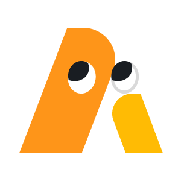
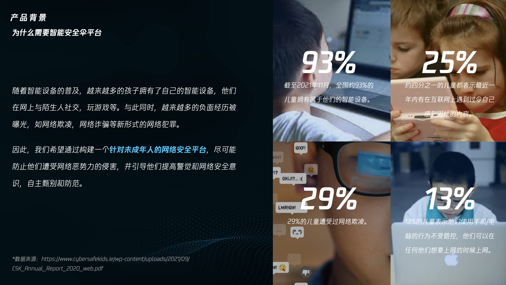
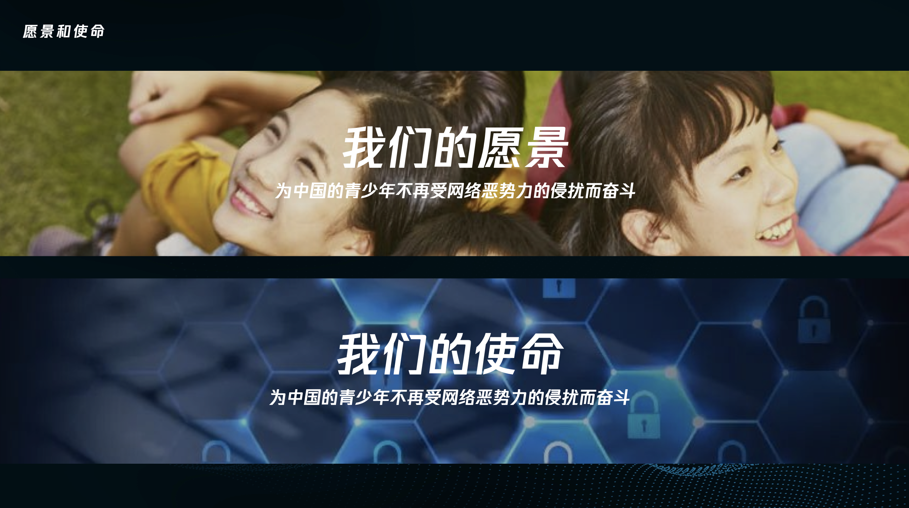
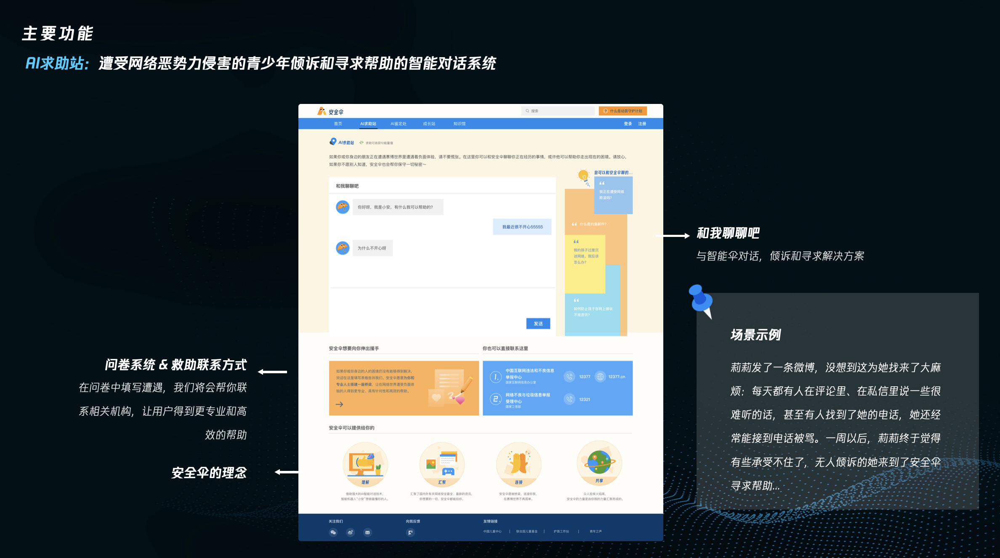

# safeumbrella-chat 智能小安对话平台

<p align="center">
    
</p>

<!-- ALL-CONTRIBUTORS-BADGE:START - Do not remove or modify this section -->
[](#contributors-)
<!-- ALL-CONTRIBUTORS-BADGE:END -->


## 项目介绍
>  本项目基于腾讯云低代码平台开发，从青少年网络安全的保护和教育两方面入手，利用腾讯大数据，集成腾讯云AI的自然语言处理（NLP）和AI内容安全平台进行关键词提取，通过对文本内容进行深度分析，实现网址风险评估， 搜索结果过滤，扫码安全提醒，智能识别短信诈骗，从外部有效地减少青少年在日常生活中可能受到的网络侵害；同时整合了国内外优质的网络安全学习资源和原创资源，以公益、免费的形式推广，来帮助青少年用户及家长们形成健康的网络安全意识。

>  另外， 我们创造性地提出了保护与教育相结合，来解决网络欺凌的方案， 即用户在发送消息之前不能确定是否会对聊天对方产生影响时，小安可以通过腾讯云的自然语言处理（NLP）接口分析预发送消息的情感倾向（积极或是消极），给予用户一定的正向引导，让“说出口的话”少些戾气，让AI更有温度！

## 产品简介


## 产品背景


## 愿景和使命


## AI求助站


## 快速上手
环境要求：Node.js >= 14
安装依赖：
```bash
yarn
```
运行项目：
```bash
yarn start
```
打包项目：
```bash
yarn build
```

